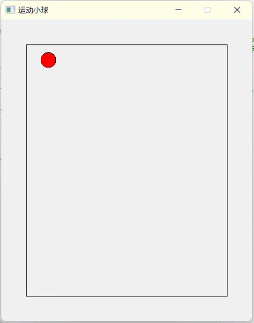

# 小球运动

 - 作者：王友铭
 - 功能：模拟小球的运动
 - 支持windows10以上系统
 

## 编译运行
使用`qtcreator`打开`test_ball.pro`  
可以在`main.cpp`中调整各种参数以获得不同的效果

## win11安装qt5
 1. 下载安装Qt, [http://download.qt.io/archive/qt/](http://download.qt.io/archive/qt/)  
    本实例使用的版本 `Qt 5.9.9`；
 2. 打开`qtcreator`编译运行项目`test_ball.pro`
## 错误处理
 1. qtcreator中一定要选择Desktop_Qt_5_9_9_MinGW_32bit编译器，debug版本，否则，可能出现不明原因错误；
 2. 尽量不要将小球的速度`dx`和`dy`调得过高，以免出现各种错误；
 3. 由于Qt与中文路径的兼容性不好，请务必将文件放在英文路径中；
 4. 若出现` no valid settings file could be found`错误，请删除`test_ball.pro.user`文件后，使用`qtcreator`打开，而后点击“项目”，在`Configure project`栏中选择合适的kits，然后点击`configure project`按钮即可重新构建和运行；
 5. 若无法看见运行示例中的gif图片，可能是DNS污染导致的，可以尝试更换网络环境后重试。
## 运行示例

    
